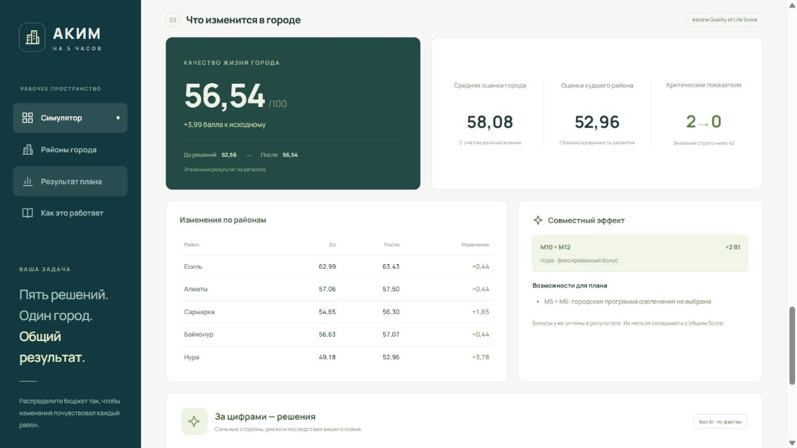

# Аким на 5 часов

Симулятор городских решений для HackAlem: участник распределяет бюджет 100 единиц между пятью мероприятиями и сравнивает последствия для пяти районов Астаны. Интерфейс показывает стоимость, ограничения, показатели районов и изменение Astana Quality of Life Score.

Используется **условный синтетический датасет** организаторов. Его показатели и эффекты мероприятий не являются актуальной статистикой или доказанным прогнозом развития города.

## Текущий статус

Работа человека 2 — веб-интерфейс на React, TypeScript и Vite, клиент относительного `/api`, отдельный демонстрационный режим, документация и сценарий защиты.

Этот этап по договорённости выполняется **без сервера**, с проверочным демо и подготовленным подключением API. Полноценный расчёт произвольных планов, настоящий ответ LLM и поиск оптимума будут подключены после передачи backend человеком 1. Проверочный ответ в деморежиме не заменяет эту интеграцию. Текущий список проверок находится в [чек-листе приёмки](Доки/acceptance-checklist.md).



[Скриншот мобильной версии](frontend/screenshots/result-mobile.png). На изображениях показан фиксированный контрольный результат без обращения к серверу.

## Запуск интерфейса

Требования: Node.js **22.12 или новее**, npm и современный браузер. Все команды ниже выполняются из папки `frontend/`:

```sh
cd frontend
npm ci
npm run dev
```

Откройте `http://127.0.0.1:5173`. По умолчанию это **режим настоящего API**: Vite перенаправляет запросы `/api` на `http://127.0.0.1:8000`. Vite привязан к IPv4; используйте указанный адрес. Если сервер не запущен, интерфейс покажет ошибку подключения. Данные не подменяются проверочным ответом автоматически.

Для другого адреса сервера задайте `API_PROXY_TARGET` перед запуском Vite. Например, в PowerShell:

```powershell
$env:API_PROXY_TARGET = 'http://127.0.0.1:8001'
npm run dev
```

Команды запуска сервера здесь намеренно не приведены до появления подтверждённой реализации. Человек 1 должен сообщить адрес, зависимости и команду запуска; затем команда проверяет интеграцию на одном и на втором ноутбуке.

### Демонстрация без сервера

```sh
npm run dev:demo
```

Этот отдельный режим включает `VITE_DEMO_MODE=true` и открывается по тому же адресу `http://127.0.0.1:5173`. Предыдущий процесс Vite на этом порту нужно остановить. На экране видна пометка деморежима.

Нажмите «Загрузить пример», затем «Рассчитать план». Демо содержит каталог и фиксированный результат **только контрольного набора** из датасета. Для других наборов нельзя получить новый вычисленный Score. Пояснение в демо — подготовленный текст без вызова модели. Для демонстрации нового произвольного результата переключитесь на `npm run dev` и подключите сервер.

### Проверки и сборка

```sh
npm test
npm run build
npm run preview
```

`npm test` запускает проверки интерфейса и клиента; они не подтверждают правильность ещё не подключённого серверного движка. `npm run build` проверяет TypeScript и создаёт статические файлы в `frontend/dist/`. `npm run preview` позволяет локально посмотреть сборку; эта команда не запускает backend.

Проверено 23.09.2026 на Windows с Node.js **24.11.0**: сборка прошла, **36 из 36 тестов** успешны (24 клиента и 12 интерфейса). В браузере проверены экран около 1265×712 и мобильный 390×844: контрольный результат, пометка «Без AI», смена района, удаление меры, фильтр экологии. Горизонтальной прокрутки страницы, ошибок и предупреждений в консоли не обнаружено. Запуск на втором компьютере и работа с настоящим backend пока не проверялись.

Для размещения статической сборки сервер размещения должен обслуживать `/api` или перенаправлять его в backend. Переменная `API_PROXY_TARGET` относится к локальному Vite, а ключ LLM хранится только на сервере. Секреты нельзя помещать в переменные `VITE_*`, поскольку они доступны браузеру.

## Данные и правила

Исходные материалы:

- [План разработки и согласованный формат API](Доки/plan-akim-2-people.md).
- [Датасет районов](Доки/Датасет%20районов.docx): пять районов, доли населения, десять показателей, 14 мероприятий и правила.
- [Техническое задание](Доки/HackAlem%20AI_%20«Аким%20на%205%20часов»%20-%20AI-симулятор%20управления%20городом.docx).

Районы: Есиль (`esil`), Алматы (`almaty`), Сарыарка (`saryarka`), Байконур (`baikonur`), Нура (`nura`). Направления: транспорт, экология, социальная сфера, безопасность и городские сервисы. Все десять показателей измеряются по шкале 0–100; больше — лучше.

В режиме `dataset` требуется ровно пять разных ID мероприятий, бюджет не более 100 и не более двух мер одного направления. Районная мера требует район, городская применяется ко всем районам и отправляется с `districtId: null`.

**Открытое уточнение организаторам:** обязательны ли все пять направлений? Пока действует режим `dataset`. Если организаторы подтвердят требование всех направлений, человек 1 включает `all_directions` на сервере для всех пользователей. Контрольный набор ниже не проходит этот режим: в нём нет транспорта. Интерфейс должен показывать полученный от сервера режим, а прежние результаты после его смены нужно пересчитать.

Несовместимости: M1 и M3 нельзя сочетать вообще; M4 и M7, а также M5 и M13 — только в одном и том же районе. Повторять одно мероприятие в разных районах также нельзя: ID должны быть различными.

### Как считается Score

Горизонт расчёта — восемь кварталов. Реализованный эффект меры равен полному эффекту, умноженному на `(8 − lag) / 8`. Сначала суммируются эффекты и синергии, затем показатели ограничиваются диапазоном 0–100. У M11 есть отрицательный эффект T1 `−2` до учёта лага.

Синергии применяются один раз без уменьшения из-за лага:

| Пара мер | Дополнительный эффект |
| --- | --- |
| M1 + M2 | T1 `+2` в районе M1 |
| M10 + M12 | B1 `+2` в районе M10 |
| M5 + M6 | E2 `+2` в районе M5 |

Оценка района — взвешенная сумма показателей. Веса T1, T2, E1, E2, S1, S2, B1, B2, C1, C2: `0.10, 0.10, 0.09, 0.11, 0.11, 0.11, 0.09, 0.09, 0.10, 0.10`. `cityAverage` — среднее оценок районов с весами по долям населения, `minDistrictScore` — оценка самого слабого района.

```text
Score = 0.7 × cityAverage + 0.3 × minDistrictScore − criticalCount
```

`criticalCount` — число пар «район × показатель» со значением **строго ниже 40**. Ровно 40 штрафа не даёт. Неиспользованный бюджет не приносит бонусных баллов. Движок не округляет промежуточные значения; интерфейс округляет отображение до двух знаков. При недопустимом или неполном наборе итоговый Score отсутствует (`result: null`), а не равен нулю.

### Контрольный набор

| Мероприятие | Область применения |
| --- | --- |
| M7 | Нура |
| M8 | Нура |
| M10 | Нура |
| M12 | Весь город |
| M5 | Сарыарка |

Ожидаемые значения из датасета и плана, используемые фиксированным демо:

| Метрика | До | После |
| --- | ---: | ---: |
| Score | 52.55768 | 56.54307 |
| Средневзвешенная оценка города | 56.8624 | 58.0776 |
| Оценка худшего района | 49.18 | 52.9625 |
| Критические показатели | 2 | 0 |
| Затраты | 0 | 95 |
| Остаток бюджета | 100 | 5 |

Изменение Score — `+3.98539`. На экране ожидаются `52,56 → 56,54`, дельта `+3,99`, затраты `95`, остаток `5`. Эти контрольные значения ещё необходимо независимо воспроизвести тестами backend и проверить через настоящий API; совпадение фиксированного демо само по себе этого не доказывает.

## Архитектура и интеграция

Целевой путь данных:

```text
Датасет → серверный валидатор и движок → числовые результаты и факты
                                                 ├→ интерфейс
                                                 └→ AI-пояснение → интерфейс
```

Браузер отправляет выбранные ID и районы. Сервер заново проверяет набор и вычисляет последствия по своему датасету. Модель получает готовые факты для объяснения сильных сторон, рисков и возможных последствий; математические результаты остаются результатами движка.

| Запрос | Назначение | Кто реализует сервер |
| --- | --- | --- |
| `GET /api/catalog` | Районы, мероприятия, правила, исходные оценки | Человек 1 |
| `POST /api/simulate` | Валидация и расчёт выбранного плана | Человек 1 |
| `POST /api/explain` | Пояснение пересчитанного сервером результата | Человек 1 |

Тела запросов и поля ответов описаны в [разделе API плана](Доки/plan-akim-2-people.md#общий-формат-данных-и-api). [Памятка для подключения frontend](frontend/API.md) и типы клиента отражают формат, ожидаемый текущим интерфейсом. Перед подключением нужно сверить фактический ответ `/api/catalog` и вложенные структуры результатов с человеком 1.

### Что передать от человека 1

Для следующего этапа нужны:

1. **Доступный backend:** ветка или коммит, подтверждённые зависимости, точная команда запуска и локальный адрес. По умолчанию frontend ожидает `http://127.0.0.1:8000`.
2. **Каталог и правила:** фактический JSON `GET /api/catalog` с районами, показателями, мерами, бюджетом, активным `ruleset`, `dataVersion` и исходными оценками. Формат сверить с [frontend/API.md](frontend/API.md).
3. **Расчёт:** рабочий `POST /api/simulate`; примеры ответов для контрольного и недопустимого набора, включая `valid`, `errors` и `result: null`; подтверждение контрольных чисел серверными тестами.
4. **Пояснение:** рабочий `POST /api/explain`, формат состояний AI/шаблона/ошибки, название модели для документации и подтверждение, что ключ остаётся на сервере. Сам ключ передавать frontend не нужно.
5. **Дополнительные возможности:** сообщить, реализован ли `/api/improve`, и передать его фактический формат и способ объявления доступности. Пока он не готов, интерфейс не должен обещать улучшение и оптимум.
6. **Решение по направлениям:** ответ организаторов о режиме `dataset` или `all_directions`. Активный режим принадлежит серверу и одинаков для всех пользователей.

Далее вместе запускаем контрольный набор, меняем одну районную меру и проверяем новый результат, недопустимый план и сбой AI. Отсутствие backend сейчас согласовано и не мешает принять текущую работу над интерфейсом; финальная сдача всего продукта требует этой интеграции.

Настоящая LLM, её провайдер и модель пока не подключены и здесь не заявляются. При недоступности объяснения вычисленный результат должен оставаться доступен, а пользователь — видеть ошибку или явно обозначенное пояснение «без AI». После изменения решений прежние результаты и пояснения должны перестать считаться актуальными; запоздавший ответ не должен подменять новое состояние.

Поиск улучшений и полный перебор сервером ещё не подтверждены. Интерфейс не заявляет глобальный оптимум и процентиль на основании контрольных чисел плана. События, лидерборд, презентация и чат-советник остаются отдельными дополнениями после основной интеграции.

## Вклад участников

| Участник | Ответственность |
| --- | --- |
| Человек 1 | `backend/`, данные, валидация, формула, расчётные тесты, AI, серверные дополнения, общий контракт и запуск |
| Человек 2 | `frontend/`, работа с API, пользовательские сценарии, README, демонстрация и проверка интерфейса |

Этот этап реализует часть человека 2. Файлы backend и общий контракт остаются за человеком 1. Совместная готовность подтверждается только после проверки реального обмена с сервером.

## Ограничения и переход к реальным данным

Симуляция задаёт эффекты мероприятий заранее. Она не учитывает неопределённость затрат, причинность, миграцию населения, различия внутри районов и внешние экономические факторы. Итоговый Score зависит от выбранных весов и штрафов; он помогает сравнивать сценарии внутри данной модели.

Для реального проекта потребуются официальная статистика населения по районам, измерения качества воздуха и транспорта, доступность школ и медицинской помощи, данные безопасности и качества городских услуг. Источники следует согласовать с владельцами городских систем и открытых данных. Затем нужны единые границы районов и даты наблюдений, документированное преобразование значений в шкалу 0–100, оценка качества данных и калибровка эффектов по наблюдаемым результатам. Одной замены исходных чисел для достоверного прогноза недостаточно.

Пятиминутный сценарий и честное разделение демонстрационного и подключённого режимов: [Доки/demo.md](Доки/demo.md).
