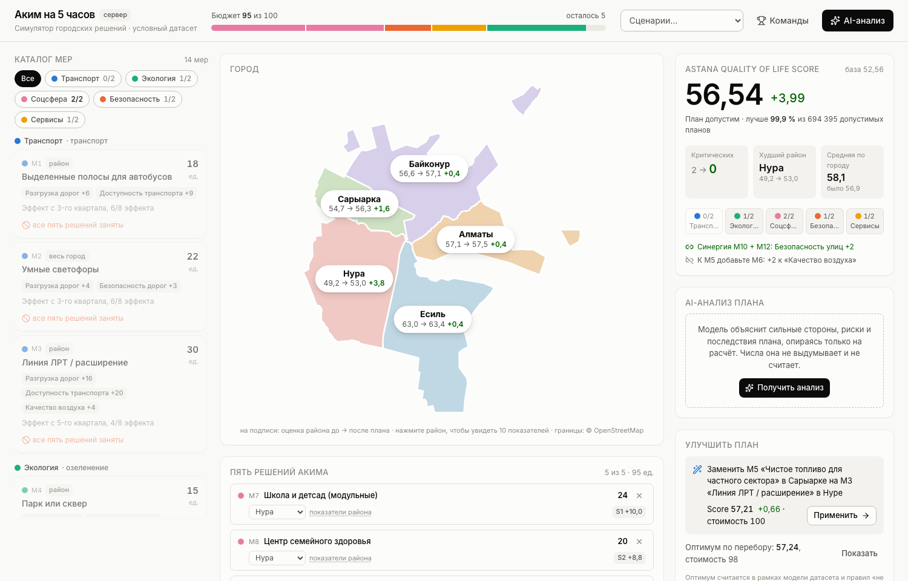
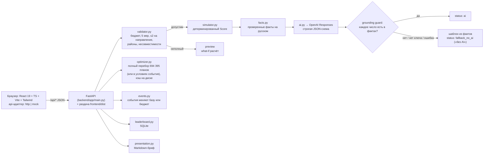

# Аким на 5 часов — AI-симулятор управления Астаной

Команда получает одинаковый бюджет (100 единиц) и одинаковые данные по пяти районам Астаны, выбирает пять управленческих решений из 14 мер по направлениям «транспорт, экология, соцсфера, безопасность, городской сервис» и сразу видит, как меняются районы и итоговый **Astana Quality of Life Score**. Расчёт делает детерминированный движок на сервере, он же не даёт превысить бюджет и нарушить правила. AI (OpenAI Responses API) объясняет сильные стороны, риски, последствия и компромиссы плана. Он получает только проверенные факты расчёта, и каждое число в его ответе сверяется с этими фактами. Полный перебор всех 694 395 допустимых планов показывает, насколько план хорош, и предлагает лучшую замену одной меры. Дополнительно есть неожиданные события, лидерборд команд и экспорт краткой презентации.



## Быстрый старт

Нужны **Python ≥ 3.10** и **Node.js ≥ 20** (Vite рассчитан на 20.19+ или 22.12+). Работает на macOS и Linux.

```bash
./scripts/setup.sh    # .venv + pip install -r backend/requirements.txt + npm ci
./scripts/start.sh    # собирает интерфейс и запускает UI + API на одном порту
```

Откройте **http://127.0.0.1:8000** (Swagger API: http://127.0.0.1:8000/docs).

**Ключ OpenAI не обязателен.** Без него всё работает: расчёт, ограничения, перебор, события, лидерборд. AI-пояснение в этом случае собирается шаблоном из тех же фактов расчёта и честно помечено «без AI». Чтобы включить модель, впишите ключ в `.env` в корне продукта (`setup.sh` создаёт его из `.env.example`) и перезапустите `start.sh`:

```bash
OPENAI_API_KEY=sk-...
AI_MODEL=gpt-6-sol        # модель по умолчанию
```

`./scripts/start.sh --rebuild` принудительно пересобирает интерфейс. Порт меняется так: `PORT=8001 ./scripts/start.sh`.

## Режим разработки

```bash
./scripts/dev.sh      # uvicorn --reload на :8000 + Vite на http://localhost:5173 (прокси /api → :8000)
```

Только интерфейс, без сервера (расчёт работает в браузере, порт движка `frontend/src/api/mock/engine.ts`):

```bash
cd frontend && VITE_API_MODE=mock npm run dev
```

## Основной сценарий

1. **Исходное состояние.** Карта показывает пять районов Астаны с оценками. Score города **52.56**, два критических показателя (школы 38 и поликлиники 35 в Нуре), худший район — Нура (49.18). Бюджет в шапке: 0 из 100.
2. **Выбор мер.** В «Каталоге мер» слева нажмите «Выбрать район» (для районной меры) или «Добавить» (для городской). В подсказке выбора района виден текущий уровень нужного показателя, а худший район помечен «нужнее всего». Недоступная мера объясняет причину: не хватает бюджета, превышен лимит направления или мера несовместима с уже выбранной.
3. **Пересчёт на каждом шаге.** После каждого решения Score, дельта, карта и плитки «Критических / Худший район / Средняя по городу» пересчитываются как предварительный расчёт («Предварительно · 3 из 5 решений»). Полоса бюджета в шапке показывает расход по мерам.
4. **Допустимый план.** На пятой мере панель показывает «План допустим» и процентиль среди 694 395 допустимых планов. Для примера организаторов (меню «Сценарии…» → «Пример организаторов», или сразу ссылкой http://127.0.0.1:8000/#example; также `#weak` и `#optimum`) Score **56.54** (+3.99), критических 2 → 0, расход 95 из 100, синергия M10 + M12.
5. **AI-анализ.** Кнопка «AI-анализ» в шапке или «Получить анализ». Панель показывает сводку, сильные стороны, риски, последствия, фразу по каждому решению и рекомендации. Метка «gpt-… · числа сверены» или «без AI · из фактов расчёта».
6. **Улучшение.** Карточка «Улучшить план» предлагает лучшую замену одной меры с новым Score (для примера: M5 в Сарыарке → ЛРТ в Нуре, **57.21**) и глобальный оптимум **57.24**. Кнопки «Применить» и «Показать» меняют план, и Score сразу пересчитывается.
7. **Событие, команды, презентация.** «Неожиданное событие → Разыграть» меняет показатели или бюджет. Например, «Секвестр бюджета» снижает лимит до 90, и план за 95 становится недопустимым, пока вы его не пересоберёте (замените M5 на парк M4 в Сарыарке: 85 из 90, **56.54**). «Улучшить план» при событии ищет оптимум уже в его условиях: при секвестре среди 400 145 планов с лимитом 90 оптимум **57.19** за 88. Первый такой запрос на событие занимает 10–20 секунд, дальше ответ берётся из кэша. «Команды» записывают Score в общий лидерборд. «Скачать презентацию» сохраняет `akim-plan.md`.

Сценарий на 3 минуты с точными кликами: [`docs/demo-scenario.md`](docs/demo-scenario.md).

## Как это устроено



- **Сервер — единственный источник истины.** Клиент присылает только `measureId` и `districtId`. Стоимость, допустимость и Score сервер считает сам; лишние поля в запросе отклоняются.
- **Детерминированное ядро + AI-комментарий.** Числа считает код, AI их только объясняет. Одинаковый план всегда даёт одинаковый Score; порядок решений не важен.
- **Оптимизатор** перебирает все допустимые наборы (694 395 для правил датасета) быстрой версией той же формулы. Тест сверяет её с основным симулятором. Результат кэшируется в `backend/data/cache/`, и дальше выдача процентиля, оптимума и лучшей замены занимает доли секунды. При активном событии перебор идёт по изменённым показателям и бюджету (у «Секвестра» 400 145 планов с лимитом 90), для каждого события свой кэш.
- **События** (4 сценария) меняют исходные показатели или бюджет до расчёта мер; база и лимит пересчитываются. Улучшение плана и AI-агент работают в тех же условиях.
- **Лидерборд** — локальный SQLite: одна запись на команду, Score пересчитывается на сервере, записи с событием не принимаются (все сравниваются в одинаковых условиях).
- **Презентация** — Markdown из тех же фактов и AI-выводов.
- **Фронтенд** обращается к API через адаптер (`frontend/src/api`): режим `http` работает с сервером, режим `mock` считает в браузере для разработки интерфейса.

Подробнее: [`docs/architecture.md`](docs/architecture.md), контракт API: [`docs/api-contract.md`](docs/api-contract.md).

## Модель расчёта

Источник: `Доки/Датасет районов.docx`, перенесён в `backend/data/{districts,measures,rules}.json`. Формулы — в `backend/app/simulator.py`.

- **10 показателей** на район (шкала 0–100): T1, T2 (транспорт), E1, E2 (экология), S1, S2 (соцсфера), B1, B2 (безопасность), C1, C2 (сервисы). Веса: 0.10, 0.10, 0.09, 0.11, 0.11, 0.11, 0.09, 0.09, 0.10, 0.10 (сумма 1).
- **Оценка района** = Σ вес_k × показатель_k.
- **Средняя по городу** = Σ доля населения района × оценка района (доли: Есиль 0.27, Алматы 0.24, Сарыарка 0.20, Байконур 0.13, Нура 0.16).
- **Astana Quality of Life Score** = 0.7 × средняя по городу + 0.3 × оценка худшего района − 1 × число критических показателей (значение строго < 40, по всем районам).
- **Лаг.** Горизонт 8 кварталов; мера с лагом L реализует долю эффекта (8 − L) / 8.
- **Эффекты** районной меры применяются к выбранному району, городской — ко всем пяти.
- **Синергии** (+2 к показателю в районе первой меры пары): M1 + M2 → T1, M10 + M12 → B1, M5 + M6 → E2. После эффектов и синергий значения ограничиваются диапазоном 0–100.
- **Несовместимости:** M1 и M3 — всегда; M4 и M7, M5 и M13 — в одном районе.
- **Ограничения плана:** ровно 5 разных мер, не больше 2 из одного направления, стоимость ≤ 100 (или ≤ 90 при событии «Секвестр бюджета»). Режим `RULESET=all_directions` дополнительно требует все пять направлений.

Контрольные числа (закреплены в `backend/tests/test_core.py`): база **52.56** (52.55768), пример организаторов **56.54** (56.54307), глобальный оптимум **57.24** (57.236735) среди **694 395** допустимых планов; в режиме `all_directions` 68 200 планов и оптимум 56.34.

## Почему AI не выдумывает числа

1. `facts.py` превращает результат расчёта в список фактов на русском: Score до/после, расход и остаток, оценки районов, реализованные эффекты каждой меры с учётом лага, синергии и упущенные синергии, неохваченные направления, событие.
2. Модель получает **только эти факты** и инструкцию не вводить новых чисел. Ответ приходит по строгой JSON-схеме: `summary`, `strengths`, `risks`, `consequences`, `recommendations`, `decisions[]`.
3. `_grounded()` в `ai.py` проверяет структуру, а также то, что `decisions` покрывают ровно выбранные меры и **каждое число в тексте встречается в фактах**.
4. Если проверка не пройдена, ключа нет или API недоступен (таймаут 16 с), пользователь получает шаблонное объяснение из тех же фактов со статусом `fallback_no_ai`. В интерфейсе оно помечено «без AI · из фактов расчёта», в презентации — «Шаблонное объяснение без AI». Выдать шаблон за ответ модели нельзя. Причина пишется в поле `fallbackReason` (например, `OpenAI: NotFoundError — модель 'gpt-6-sol' недоступна для ключа`) и в лог сервера (логгер `akim.ai`, уровень WARNING). Ключ не попадает ни в ответ, ни в лог.
5. Ответы кэшируются по хэшу `dataVersion + ruleset + модель + версия промпта + факты`: повторный анализ того же плана мгновенный и одинаковый.

## AI-агент с инструментами

Кнопка «Запустить агента» (карточка «AI-агент» справа) запускает настоящий tool-using агент на OpenAI Responses API (`backend/app/agent.py`, `POST /api/agent`). Модель сама решает, что проверить, и вызывает инструменты сервера:

| Инструмент | Что делает |
| --- | --- |
| `simulate_plan` | прогоняет любой вариант плана через валидатор и симулятор: допустимость, стоимость, Score, худший район, синергии |
| `find_improvements` | полный перебор 694 395 допустимых планов (при событии — в его условиях): процентиль, оптимум, лучшая замена одной меры или лучшее дополнение неполного плана |

Цикл: агент проверяет текущий план → выдвигает 1–4 гипотезы (с учётом цели пользователя, например «подтянуть Нуру и уложиться в 90») → проверяет каждую инструментом → возвращает вывод, риски и один рекомендуемый план. Сервер **заново симулирует** рекомендованный план (агенту на слово не верим), а каждое число в тексте агента сверяет с результатами вызовов инструментов. Если число не подтверждено, текст агента всё равно возвращается, но с `grounded: false` и пояснением `groundingNote`: опираться нужно на числа из шагов и проверенной рекомендации. Весь ход работы агента (какие планы он проверил и что получил) показывается пошагово, рекомендованный план применяется одной кнопкой.

Включение: впишите `OPENAI_API_KEY` в `product.v2/.env` и перезапустите `./scripts/start.sh`. Без ключа агент честно отвечает `unavailable`, остальной продукт работает. При ошибке модели ответ `status: "error"` с конкретной причиной в `reason`. Лимит вызовов инструментов — `AGENT_MAX_TOOL_CALLS` (по умолчанию 8). Цикл агента покрыт тестом со сценарной моделью (`test_agent_tool_loop_with_scripted_model`): проверяются вызовы инструментов, пересчёт рекомендации и срабатывание проверки чисел.

## Соответствие требованиям

| Требование ТЗ | Где реализовано |
| --- | --- |
| Единый бюджет и данные для всех | `backend/data/*.json`, `rules.budget = 100`; сервер пересчитывает всё сам, клиент передаёт только ID (`schemas.py`, `extra="forbid"`); `RULESET` задаётся на сервере |
| Решения по 5 направлениям | 14 мер в `measures.json` по направлениям transport / ecology / social / safety / services; UI: «Каталог мер», «Пять решений акима», покрытие направлений в панели результата |
| Автоматический контроль превышения бюджета | `validator.py` → `BUDGET_EXCEEDED`; полоса бюджета в шапке («превышен на …»); недоступные по цене меры в каталоге |
| AI-анализ | `POST /api/explain` (`ai.py`, OpenAI Responses, JSON-схема); UI: кнопка «AI-анализ», панель «AI-анализ плана» |
| Расчёт Astana Quality of Life Score | `simulator.py`; `POST /api/simulate`; UI: панель «Astana Quality of Life Score» |
| Сильные стороны, риски, последствия | поля `strengths`, `risks`, `consequences`, `decisions[]` ответа `/api/explain`; блоки «Сильные стороны / Риски / Последствия / По каждому решению» |
| *Опц.* Сравнение команд | `POST/GET /api/leaderboard`, `leaderboard.py` (SQLite); UI: кнопка «Команды» |
| *Опц.* Визуализация изменений районов | карта районов Астаны (контуры OpenStreetMap) с оценками до → после; панель района с показателями до/после; `criticalBefore/criticalAfter` |
| *Опц.* AI-рекомендации по улучшению | `recommendations` в `/api/explain` + `POST /api/improve` (полный перебор: процентиль, оптимум, лучшая замена; работает и при событии) + AI-агент `POST /api/agent`; UI: «Улучшить план» → «Применить» |
| *Опц.* Неожиданные события с перераспределением бюджета | `events.py`, `POST /api/events/draw`, `eventId` в `/api/simulate`, `/api/improve` (перебор в условиях события) и `/api/agent`; UI: «Неожиданное событие» → «Разыграть / Другое событие / Сбросить» |
| *Опц.* Автогенерация краткой презентации | `POST /api/presentation` (`presentation.py`); UI: «Скачать презентацию» → `akim-plan.md` |
| Проверка 1: одинаковый бюджет и данные | `GET /api/catalog` одинаков для всех; лидерборд не принимает планы с событием; тест `test_dataset_and_baseline` |
| Проверка 2: нельзя превысить бюджет | `BUDGET_EXCEEDED`, `result = null`; тесты `test_rejection`, `test_events_recalculate_budget_and_baseline` |
| Проверка 3: решения влияют на показатели | `result.districts[].beforeIndicators/afterIndicators`; тест `test_example_and_order_independence` |
| Проверка 4: AI объясняет результат и компромиссы | `/api/explain` + guard; тесты `test_ai_numerical_guard`, `test_ai_structured_response_path_without_external_call` |
| Проверка 5: изменение решений меняет Score | пример 56.54 → замена M5 на M3 в Нуре 57.21 → оптимум 57.24; при секвестре (лимит 90) оптимум 57.19; тесты `test_improve_and_completion`, `test_fast_search_score_matches_public_simulator_across_plans`, `test_improve_during_event_uses_event_budget_and_matches_simulate` |

Самооценка по критериям жюри: [`docs/criteria.md`](docs/criteria.md).

## Проверка

```bash
./scripts/test.sh     # pytest (backend) + npm run typecheck + npm run build (frontend)
```

При запущенном сервере (`./scripts/start.sh`):

```bash
curl -s http://127.0.0.1:8000/api/health
# {"status":"ok","ruleset":"dataset","dataVersion":"akim-dataset-v1","aiConfigured":false,"aiModel":"gpt-6-sol"}

PLAN='{"decisions":[{"measureId":"M7","districtId":"nura"},{"measureId":"M8","districtId":"nura"},{"measureId":"M10","districtId":"nura"},{"measureId":"M12","districtId":null},{"measureId":"M5","districtId":"saryarka"}]}'

curl -s -X POST http://127.0.0.1:8000/api/simulate -H 'Content-Type: application/json' -d "$PLAN" \
  | python3 -c 'import json,sys; r=json.load(sys.stdin); print(r["valid"], r["cost"], round(r["baseline"]["score"],2), round(r["result"]["score"],2))'
# True 95 52.56 56.54

# Тот же план при событии «Секвестр бюджета» (лимит 90) — недопустим
curl -s -X POST http://127.0.0.1:8000/api/simulate -H 'Content-Type: application/json' \
  -d "${PLAN%\}}"',"eventId":"budget_cut"}' \
  | python3 -c 'import json,sys; r=json.load(sys.stdin); print(r["valid"], r["budget"], [e["code"] for e in r["errors"]])'
# False 90 ['BUDGET_EXCEEDED']

curl -s -X POST http://127.0.0.1:8000/api/improve -H 'Content-Type: application/json' -d "$PLAN" \
  | python3 -c 'import json,sys; r=json.load(sys.stdin); print(r["populationCount"], round(r["percentile"],1), round(r["globalOptimum"]["score"],2), round(r["bestSingleSwap"]["plan"]["score"],2))'
# 694395 99.9 57.24 57.21

# Улучшение при секвестре: M5 заменена на M4 в Сарыарке (85 из 90); первый запрос 10–20 с
CUT='{"decisions":[{"measureId":"M7","districtId":"nura"},{"measureId":"M8","districtId":"nura"},{"measureId":"M10","districtId":"nura"},{"measureId":"M12","districtId":null},{"measureId":"M4","districtId":"saryarka"}],"eventId":"budget_cut"}'
curl -s -X POST http://127.0.0.1:8000/api/improve -H 'Content-Type: application/json' -d "$CUT" \
  | python3 -c 'import json,sys; r=json.load(sys.stdin); o=r["globalOptimum"]; print(r["populationCount"], round(r["current"]["score"],2), round(r["percentile"],1), round(o["score"],2), o["cost"])'
# 400145 56.54 99.9 57.19 88

curl -s -X POST http://127.0.0.1:8000/api/explain -H 'Content-Type: application/json' -d "$PLAN" \
  | python3 -c 'import json,sys; r=json.load(sys.stdin); print(r["status"], r["grounded"], r["fallbackReason"]); print(r["summary"])'
```

## Если что-то не работает

- **AI-анализ пришёл «без AI», хотя ключ задан.** Причина — в поле `fallbackReason` ответа `/api/explain` (последний `curl` выше) и в подсказке чипа «без AI» в интерфейсе; та же строка есть в логе сервера (`akim.ai`). Чаще всего это `NotFoundError`: модель из `AI_MODEL` недоступна вашему ключу. Укажите в `.env` модель, доступную ключу (для агента — с поддержкой function calling), и перезапустите `./scripts/start.sh`. `AuthenticationError` означает, что ключ неверен или отозван.
- **«Улучшить план» при событии думает 10–20 секунд.** Так и должно быть: первый запрос для каждого события перебирает все планы в условиях события. Результат кэшируется в `backend/data/cache/`, повторные запросы мгновенны. `start.sh` заранее прогревает только перебор без события, чтобы запуск оставался быстрым.
- **Порт 8000 занят.** Запустите на другом: `PORT=8001 ./scripts/start.sh`.

## Структура репозитория

```text
product.v2/
├── README.md
├── .env.example              шаблон настроек (ключ OpenAI, модель, RULESET, CORS)
├── scripts/
│   ├── setup.sh              .venv + pip + npm ci, проверка версий
│   ├── start.sh              сборка UI + сервер на http://127.0.0.1:8000
│   ├── dev.sh                uvicorn --reload :8000 + Vite :5173
│   ├── test.sh               pytest + typecheck + build
│   └── build_geometry.py     GeoJSON районов → SVG-контуры для карты
├── backend/
│   ├── requirements.txt
│   ├── app/
│   │   ├── main.py           FastAPI: эндпоинты, preview, раздача frontend/dist
│   │   ├── schemas.py        строгие схемы запросов (лишние поля → 422)
│   │   ├── data_loader.py    загрузка и fail-fast проверка датасета
│   │   ├── validator.py      правила плана и коды ошибок
│   │   ├── simulator.py      формула Score, лаги, синергии, критические показатели
│   │   ├── optimizer.py      полный перебор, процентиль, оптимум, лучшая замена
│   │   ├── facts.py          факты расчёта для AI и шаблона
│   │   ├── ai.py             OpenAI Responses, JSON-схема, grounding guard, fallback
│   │   ├── events.py         неожиданные события
│   │   ├── leaderboard.py    SQLite-лидерборд
│   │   └── presentation.py   Markdown-презентация
│   ├── data/                 districts.json, measures.json, rules.json (+ cache/, создаётся)
│   └── tests/test_core.py    контрольные числа и сценарии
├── frontend/
│   ├── src/App.tsx           компоновка экрана
│   ├── src/api/              адаптер API: http.ts (сервер), mock/ (расчёт в браузере), types.ts
│   ├── src/components/       шапка, каталог, карта, портфель, результат, AI, улучшение, событие, лидерборд
│   ├── src/data/             dataset.ts, astana_districts.geojson, astanaGeometry.ts
│   ├── src/state/, src/lib/  состояние плана, пересчёт, шкалы, форматирование
│   └── README.md
└── docs/
    ├── api-contract.md       контракт API
    ├── architecture.md       компоненты, поток данных, решения
    ├── demo-scenario.md      сценарий демо на 3 минуты
    ├── criteria.md           самооценка по критериям жюри
    └── screenshot.png        снимок интерфейса (картинка в начале README)
```

## Ограничения и развитие

**Ограничения.** Данные синтетические, из датасета хакатона. Score показывает последствия по заданной модели, а не прогноз для реальной Астаны. Эффекты мер линейные и не зависят друг от друга, кроме трёх синергий. Лидерборд хранится локально на одном сервере. Перебор после события считается отдельно для каждого события: первый запрос занимает 10–20 секунд, потом ответ берётся из кэша.

**Развитие:**
- реальные открытые данные акимата Астаны и stat.gov.kz вместо синтетических показателей;
- больше районов и микрорайонов через GeoJSON: геометрия карты уже строится из OSM (`scripts/build_geometry.py`);
- масштабирование поиска оптимума: сейчас точный перебор ~7·10⁵ планов занимает 10–20 секунд. При росте каталога (больше мер, районов, решений; примерно от 10⁷ планов) перейти на branch-and-bound с отсечением по верхней оценке Score или на beam search с той же `fast_score`. Для датасета хакатона оставляем точный перебор: он даёт честный глобальный оптимум и процентиль;
- несколько агентов-советников по направлениям (транспорт, экология…) поверх уже работающего агента с инструментами, которые спорят о компромиссах;
- общий облачный лидерборд для одновременной игры многих команд;
- история сценариев: сравнение версий плана и «перемотка» решений.

## Источники данных

- Показатели районов, 14 мероприятий, веса, лаги, синергии и ограничения — синтетический датасет организаторов, `Доки/Датасет районов.docx`.
- Границы районов Астаны — © участники OpenStreetMap, лицензия ODbL (`frontend/src/data/astana_districts.geojson`, упрощено до ~40 м).
